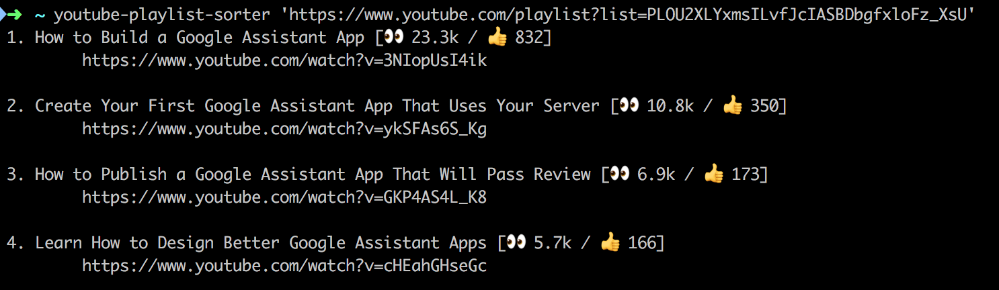

# youtube-playlist-sorter
[](https://www.npmjs.com/package/youtube-playlist-sorter)
[](https://www.npmjs.com/package/youtube-playlist-sorter)

Sorts ↕️ a public playlist based on its popularity 🔥

## :floppy_disk: Installation
```sh
$ npm i -g youtube-playlist-sorter
```

## :arrow_forward: Usage
Create an `API_KEY` ([how to create the key](https://developers.google.com/youtube/v3/getting-started)) and put it in your `~/.bashrc`.

```sh
echo 'export YOUTUBE_PLAYLIST_SORTER_API_KEY=AIzaxxxxxxxyyyyyyyyzzz' >> ~/.bashrc
source ~/.bashrc
```




## :wrench: Project Setup (Development)

1. Clone the repo

2. Run ``` npm install ``` inside the directory

3. Get/create the API_KEY (as explained previously)

4. Run the program

```
$ npm run dev <PLAYLIST_URL>
```

## :mortar_board: License
MIT
